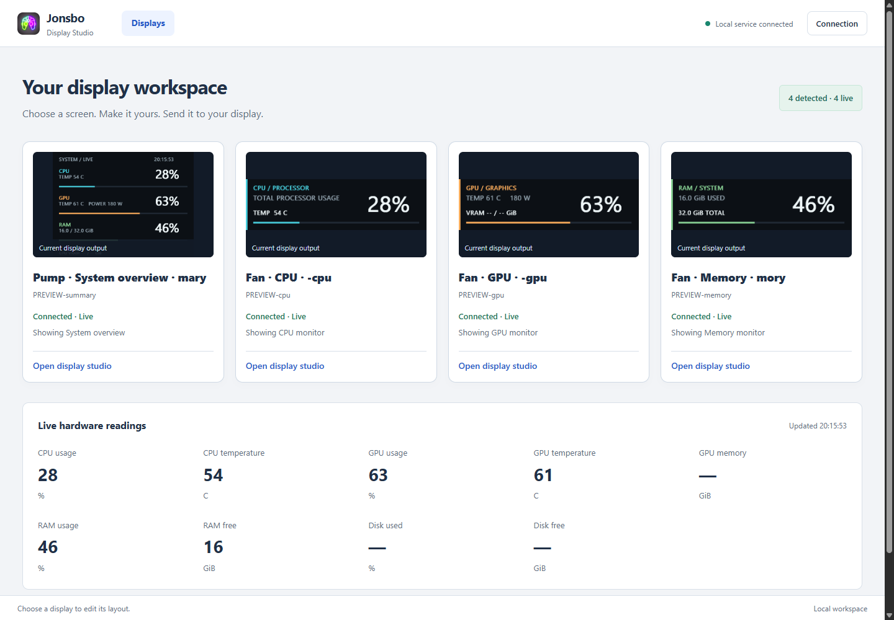
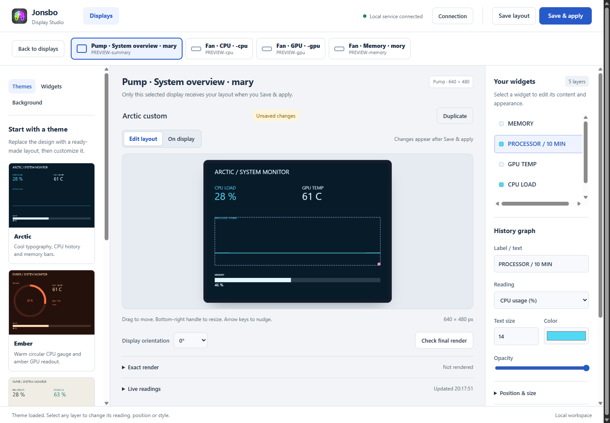
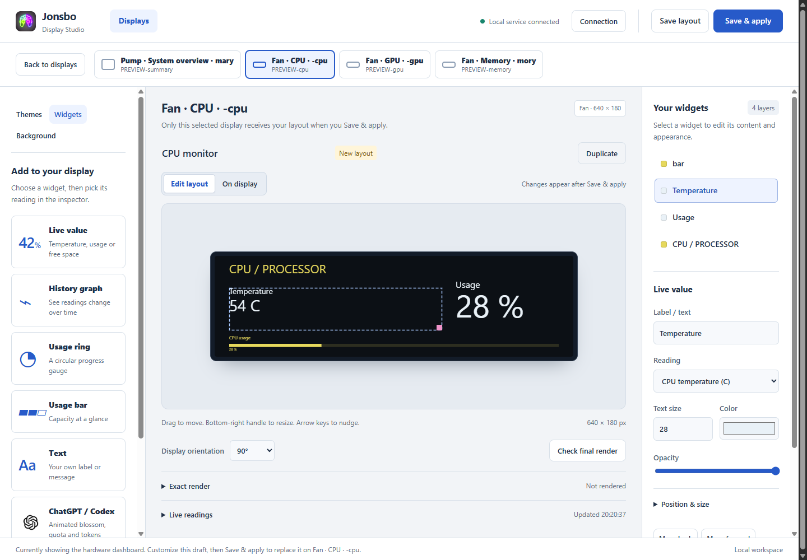
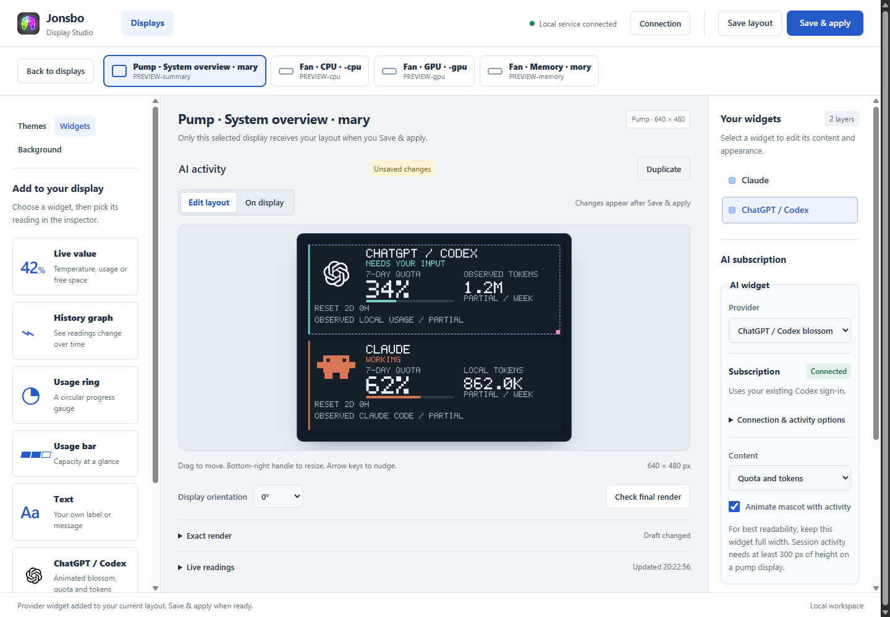

# Jonsbo Resurrection

A modular Go controller for the four screens on a **JONSBO TF3-360SC**, starting with Windows amd64. It sends images directly through WinUSB and exposes live module data, image previews, events, and screen assignments through a local HTTP API.

This is an experimental, community-oriented project, independent of JONSBO. Hardware support has been verified on one TF3-360SC installation. It changes display content, not cooling settings or firmware.

## Screenshots

The **v0.5.0 Display Studio** below uses a temporary four-display demo with sample sensor readings, subscription quotas and activity. The screenshots show the current interface; they do not represent a user's account usage.

**Your displays** — see all four screens, their current output and connection status, alongside CPU/GPU temperatures, memory usage and free disk space. Select a screen to edit it.



**Layout editor** — start with a theme, select an overlay, and adjust its sensor reading, appearance and position. The selected display remains visible above the canvas.



**Fan layouts** — the editor opens the chosen CPU, GPU or memory screen's own content, with readable widget settings and a full-width preview. Switch between **On display** and **Edit layout** to compare the assigned output with your draft.



**AI activity** — add a ChatGPT / Codex blossom or Claude crab from the widget library. Animations are drawn from code. The blossom uses white strokes on the dark screen with no white box; large quota and token values remain readable on fan displays. Existing sign-in status and any needed **Sign in / Reconnect** controls live inside each widget's settings.



See the [configurator guide](docs/configurator.md) for themes, widgets, backgrounds and saving layouts.

## What works

- Hardware module: CPU usage and Ryzen temperature, system RAM, AMD GPU usage/temperature/power/clocks/fan speed, and dedicated VRAM used/total.
- Pump summary and separate CPU, GPU, and RAM fan views.
- Module lifecycle/status, authenticated JSON API, server-sent state updates, PNG previews, and live view assignment.
- Example Go module with message events, a generated sparkline, and an animated progress bar; an external event-producer boilerplate.
- Static PNG/JPEG upload, orientation correction, per-display workers, and reconnection attempts for selected serials.
- Display Studio with themes, editable widgets, saved layouts, image/video-frame backgrounds and the selected display's current output.
- Native Codex/Claude subscription monitoring, readable animated AI widgets, local session activity and optional browser companion feeds.

The [AI subscription guide](docs/ai-subscriptions.md) explains sign-in detection, monitoring and optional activity setup. Quotas, weekly tokens and current context show only what the available feeds report; missing data stays unavailable and local/partial values are labelled. Windows notification capture, persistent historical charts, full-motion video playback and a module marketplace remain unimplemented.

## Download for Windows

Get the [latest versioned release](https://github.com/kawapiki/Jonsbo-resurrection/releases/latest), extract the complete ZIP, and run **JonsboResurrection.exe**. The signature icon appears in the Windows tray. Right-click it to start/stop monitoring, open logs, or enable launch at sign-in. No Go installation is needed.

See the [Windows app guide](docs/windows-app.md) for startup, optional elevated CPU temperature support, updates and troubleshooting. Public binaries are currently unsigned.

Merging a PR runs CI but does not publish a new download. Releases are built and published automatically when the maintainer pushes a `v<version>` tag matching `VERSION`; versions such as `0.4.0-dev` are prereleases. See the [release procedure](docs/releasing.md).

## Build from source

Build from the repository root with Go 1.24+ on Windows amd64:

```powershell
.\scripts\build.ps1
.\bin\jonsbo.exe list
# API and image previews; does not take control of USB displays:
.\bin\jonsbo.exe serve --example
```

Close the original JONSBO app, including its tray process, before driving the displays:

```powershell
# Hardware dashboards plus the local API:
.\bin\jonsbo.exe serve --all
# Hardware dashboards without HTTP:
.\bin\jonsbo.exe monitor --all
```

CPU temperature requires the separately installed **signed PawnIO driver** and administrator access. Other supported readings work without elevation. For hidden background operation after installing the optional sensor driver:

```powershell
.\scripts\start-server.ps1 -Elevated -Displays -Example
.\scripts\stop-monitor.ps1 -Server
```

The API listens on `127.0.0.1:8787`. On first use it creates `bin/api-token`; API routes require that bearer token, while the editor shell/assets are public on loopback. Keep the token file private and out of commits. Hardware monitoring needs no cloud account; optional AI widgets reuse your provider's native subscription login. The CLI does not add startup entries; use the tray startup controls to opt in.

```powershell
$headers = @{Authorization = 'Bearer ' + (Get-Content .\bin\api-token -Raw).Trim()}
Invoke-RestMethod http://127.0.0.1:8787/v1/modules -Headers $headers
Invoke-RestMethod http://127.0.0.1:8787/v1/modules/hardware -Headers $headers
# With the example module enabled:
go run ./examples/event-producer -token-file bin/api-token -message 'Build complete'
```

## Customize and extend

The [local display configurator](docs/configurator.md) adds editable overlays, five preset themes, history/usage charts, storage free space, AI activity and saved image/video-frame backgrounds. Choose **Open configurator** from the tray, select a display, and use **Save & apply** when your layout is ready. Read the [v0.5.0 release notes](docs/releases/0.5.0.md) for the new features and display-preview fixes.

Start with [configs/example.json](configs/example.json), then run:

```powershell
.\bin\jonsbo.exe serve --config configs/example.json --all
```

Configuration paths are relative to the current working directory. Without `--all`, configured display assignments are unused and USB remains untouched. With `--all`, the default assignments are pump → `hardware/summary`, then fans in serial order → `hardware/cpu`, `hardware/gpu`, `hardware/memory`. Fan rotation defaults to 90° clockwise for the verified horizontal installation; configure each screen for your mounting orientation.

A module publishes JSON and can optionally implement image rendering and typed event handling. Register its factory in `cmd/jonsbo/runtime_windows.go`; the API and USB layer need no module-specific changes. Modules are trusted compiled-in Go code. External integrations can run in any language and send JSON events through the API.

- [Module author guide and boilerplate](docs/modules.md)
- [HTTP API](docs/api.md)
- [Architecture](docs/architecture.md)
- [Hardware support and sensor requirements](docs/hardware-monitoring.md)
- [Contributing](CONTRIBUTING.md)
- [Security model](SECURITY.md)
- [Release preparation](docs/releasing.md)

## Other commands

```powershell
.\bin\jonsbo.exe stats --count 5
.\bin\jonsbo.exe inspect --serial YOUR_DISPLAY_SERIAL
.\bin\jonsbo.exe image --serial YOUR_DISPLAY_SERIAL --file image.png --rotate 90
.\bin\jonsbo.exe pattern --serial YOUR_DISPLAY_SERIAL --number 2 --preview preview.png
.\bin\jonsbo.exe stop --server
```

`stats` keeps its original hardware JSON shape. API responses wrap that data with module identity, status, and timestamps. Missing sensor values are `null` / `--`, not synthetic zeroes. The conservative full-frame USB path is suitable for dashboards; configurable frame refresh is 500 ms or slower and is not a video-rate playback implementation.

## License and dependencies

Project source: [MIT](LICENSE), with the repository maintainer's copyright notice. The embedded signed PawnIO module retains its LGPL license and matching source archive in `third_party/pawnio/`. See [third-party notices](THIRD_PARTY_NOTICES.md). There are no third-party Go modules or CGO requirements; Windows sensor and USB drivers remain runtime dependencies.

Downloaded tools, original vendor binaries, decompiled research, USB captures, logs, and API tokens are excluded from source and binary packaging. See [protocol notes](docs/protocol.md) and [verification history](docs/verification.md) for observed hardware behavior.
