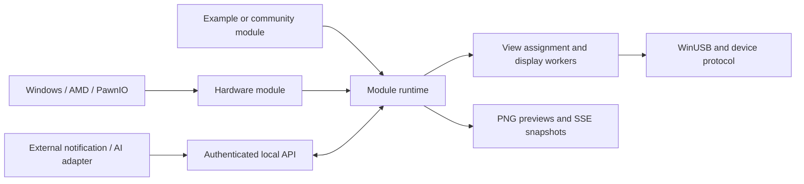

# Architecture

The application has three extension boundaries: module data/events, logical images, and physical display transport.

| Package | Responsibility |
| --- | --- |
| `pkg/module` | Public Go contracts, descriptors, views, events, states, error categories |
| `internal/engine` | Registration, lifecycle, state ownership, latest-only subscriptions, event/frame routing |
| `modules/hardware` | Sensor acquisition cadence and the existing four hardware views |
| `modules/example` | Portable, runnable module and render/event example |
| `internal/telemetry` | Windows/AMD/PawnIO hardware access; unavailable value semantics |
| `internal/dashboard` | Current hardware layout and Windows GDI text rendering |
| `internal/output` | Assignments, logical-to-native rotation/scaling, one worker per selected display |
| `internal/device`, `protocol`, `winusb`, `display` | USB discovery, validation, packet encoding and acknowledged transfers |
| `internal/api` | HTTP validation/authentication, JSON, SSE and PNG routes |
| `internal/config` | Strict local configuration and token-file creation |
| `cmd/jonsbo` | Composition/factories, CLI flags, HTTP listener, shutdown and instance control |

## Lifecycle and ownership

Factories construct modules without opening sensors. `Run` owns its resources and releases them on cancellation. A hardware module primes counters before publishing its first sample. `monitor`, `stats`, and `serve` use the same runtime and hardware module. The engine retains JSON snapshots rather than pointers to a module's mutable data. Each subscriber has one pending full snapshot; intermediate states can be dropped for slow clients.

Each display worker requests its assigned logical view at the configured frame cadence, scales/rotates it, opens a fresh handle, sends a complete frame, and records success or error. There is no frame backlog. A slow screen does not block another. A reassignment may let a frame already in flight finish, but that frame is not recorded as confirmation of the new assignment. Assignments changed through HTTP are in memory; persist them explicitly in local configuration before restarting.

Module failures are isolated and appear in state. Panics in a module's Run/render/event method are caught at the runtime boundary. This is fault containment, not a security sandbox: compiled modules are trusted code. Native driver calls are not forcibly cancellable; shutdown waits are bounded at the command layer. No unbounded retry goroutines are created for a stalled call. API consumers must check `updated_at` as well as status; state retains the last sample for inspection rather than silently replacing it with zeroes.

## Extension directions

- Notifications: external event producer plus a module implementing priority, expiry and rendering. The example only accepts a message; it is not a notification queue.
- AI agents: adapters obtain authorized data from official interfaces or user-provided exports, then emit typed events. Task/usage visibility differs by provider. No token/session scraping is supplied.
- Charts/designs: render an `image.Image` from module state. Add bounded history inside the relevant module; do not put historical storage in the USB layer.
- Temperature animation: consume actual temperature data in a renderer or a dedicated composed module, define behavior for null/stale inputs, and generate a new frame on each refresh. The example demonstrates color interpolation and time-varying shapes with explicitly synthetic input.
- Video: a future decoder can implement frame rendering, but must negotiate a tested transfer cadence and drop outdated frames. The current complete-frame reset protocol is not a promised video playback path.

The public HTTP contract is `/v1` and the Go contract version is1. This project is experimental; document compatibility changes before distributing a stable release. The public Go module path is `github.com/kawapiki/Jonsbo-resurrection`.
