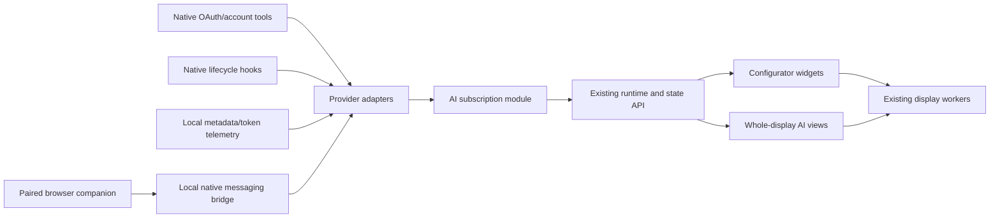

# AI subscription display module

Date: 2026-10-07. Status: approved on 2026-10-07; the user requested implementation with parallel specialized agents.

## Intended outcome

Add an AI subscription module to Jonsbo Resurrection. The user connects ChatGPT/Codex and Claude subscription accounts, adds animated provider widgets to a physical display, sees quota/reset information and consumed tokens, and follows running chats with context usage where observable. The user confirmed coverage should include both desktop/CLI and browser conversations.

Assumptions: start with one linked account per provider; monitor activity without sending model requests; interpret “spent token” as tokens consumed. Monetary billing is optional future data, never inferred from token totals. The authoritative capability findings and primary links are in [the research report](../../ai-subscription-research.md).

## Approach choices

| Approach | Benefit | Limitation |
| --- | --- | --- |
| Native account connections plus local telemetry and browser companion (recommended) | Uses established subscription login; supports observed native sessions and visible browser activity | Requires optional telemetry/hooks setup and browser pairing; browser exact context can be unavailable |
| Direct provider OAuth throughout | Gives the module its own account connection | A comparable personal monitoring interface is not established for both providers; identity alone does not expose chats |
| Private endpoints and internal transcript/database scraping | Can expose additional implementation-specific fields | Unstable and inconsistent with this project's documented integration boundary |

Choose the first approach. Each adapter publishes its capabilities and data coverage. A connected account can remain connected while individual data feeds are unavailable.

## Architecture and repository integration

Use the existing trusted compiled-in Go module contract. Add `modules/aisubscriptions`, registered as `ai-subscriptions` in `cmd/jonsbo/runtime_windows.go`. Implement `module.Module`, `module.Renderer`, and `module.EventHandler`. Keep native account/process handling and provider-specific parsers under `internal/aiadapters`; USB/output code continues consuming logical images.

Publish normalized immutable snapshots. Add a narrow module controller to the authenticated HTTP API for connection/setup actions; use the existing module event route for normalized adapter observations. Native telemetry intake accepts bounded OTLP/HTTP JSON with authentication and reduces it to allowlisted metadata before storage. Configure exporters to avoid prompt/response content, and discard unexpected content fields.

The configurator currently has a fixed hardware metric catalog and sensor parser. Extend those deliberately with AI metrics and a provider widget; this feature cannot be delivered only by registering a renderer. Preserve existing saved layouts and hardware behavior.

## Account connections

OpenAI: launch a managed `codex app-server` helper over stdio with a dedicated application credential/config directory. Use its supported account interface for login/status and subscription reporting. It owns OAuth callback/renewal. The module launches no turns. Consume optional account daily buckets and detected quota windows. Capability-check the installed protocol and tolerate unsupported methods. The helper's thread events cover only sessions it observes; hooks/telemetry provide activity from separately running native clients.

Claude: offer native `claude auth login --claudeai` and verify the subscription authentication mode through native status. Claude Code owns the credentials. Show “Connected through Claude Code” so the connection mechanism is clear. Collect optional quota/context observations through a small status-line helper, lifecycle through hooks, and consumed tokens through telemetry. Setup must preserve an existing status-line command and existing hooks/exporters; generate a mergeable setup proposal and report conflicts rather than overwrite them.

Disconnect detaches the module's feeds and clears its account-scoped cache. A separate explicit sign-out action is needed to log out a shared native Claude installation. All helper processes use fixed executable paths/arguments, timeouts, bounded output, cancellation, and hidden windows on Windows.

## Browser and desktop coverage

Create an optional Chromium companion restricted to `chatgpt.com` and `claude.ai`. Users pair it locally and enable observation. Read only visible session metadata: provider, page/session identifier, visible title/model, generating/idle state, and any explicitly displayed quota or context statistic. Do not inspect cookies, internal application state, private network responses, or conversation bodies. Closed tabs are removed; background or suspended tabs become stale when observation is no longer reliable.

Send observations through a local native-messaging bridge using a dedicated scoped credential. The bridge translates them to module events; it does not relax the current API Origin policy or reveal the controller's master bearer token to content scripts. Exact web-chat token consumption/context remains null when unexposed. Keep this browser integration optional and version-test DOM selectors separately.

Claude Code Desktop local sessions can use shared hooks. Ordinary desktop chat and remote/cloud sessions are represented only when a separately supported feed is present. Codex native hooks/telemetry provide activity after setup; full context coverage for independently running processes must be validated before being advertised. Starting a fresh app-server does not prove another process's chat is running.

## Normalized state and counting

| Record | Required interpretation |
| --- | --- |
| Provider account | Provider ID, opaque account key, auth mode, optional plan, connection/health state, source and observation time |
| Quota window | Provider-reported used percentage, optional duration/reset, limit ID, observation time; select weekly by duration rather than field position |
| Usage summary | Tokens, interval, source coverage, completeness, category semantics, observation time; nullable if unknown |
| Session | Provider/account/session identity, model/title when known, activity state, last observation, cumulative consumed tokens, current context/limit when known |
| Capability | Supported/unavailable for account quota, account token history, local sessions, browser activity, exact context, and actual billing |

Every numeric quantity carries its source and freshness. Represent absent values as null and render `--`. Keep authentication, feed health, and task activity independent.

Accept account-scoped observations only when the adapter can verify the originating subscription identity. A global CLI login is insufficient evidence that an already-running session uses that account. Keep unattributed sessions in a separate observed-local group and exclude them from linked-account totals. API-key, Console OAuth, Bedrock, and other provider sessions are outside subscription totals; ambiguous auth modes remain unknown. Refresh native account status on the same 60-second account cadence.

Display “7-day quota” for the provider's window. Display “Tokens this week” for an explicitly bounded reporting interval, defaulting to Monday 00:00 in Europe/Budapest for timestamped local observations. Provider date-only buckets retain provider-day semantics; use a distinct provider-day label until the source's timezone is established. Do not invent empty buckets as zero or claim complete coverage after installation midweek.

For account totals, choose the authoritative available feed rather than adding account buckets to local observations. For observed totals, deduplicate per provider/account/request ID, including retransmission and adapter restart. Retain deduplication keys for the history horizon. Resumed process counters need a process-instance baseline; a counter decrease is not negative usage. A repeated context snapshot adds no consumed tokens.

Preserve provider token-category conventions. Claude input/cache categories are separately additive; cached/reasoning subcategories in other provider totals may already be included. Record the provider's reported total when available. Session lifetime consumed tokens never substitute for current context usage. Around compaction, clear obsolete context information until a fresh observation arrives.

## Display and configurator behavior

Expose whole-display views `overview` (640 x 480), `openai` and `claude` (640 x 180), and `sessions` (640 x 480). Add a draggable `ai-provider` overlay to the configurator with provider, detail level, and animation preferences. Add AI numeric metrics to existing value/bar/ring widgets; validate the new overlay in the Go renderer and browser editor consistently.

Use official provider marks with their proportions/colors preserved, with a moving surrounding ring/glow for connected accounts. Animate task activity separately: slow connected pulse, brighter running pulse, waiting indicator, and static disconnected/reauthentication state. Offer animation off. Logical frames use the existing 500 ms-or-slower dashboard cadence; no video-rate promise.

The pump overview presents provider connection, weekly quota/reset, source-labeled token totals, and a bounded list of active sessions with context bars. A fan view presents one provider compactly. The editor exposes Connect, setup status, Manage usage, provider widget previews, and Save & apply. Unavailable data appears as an ordinary missing field, not a synthetic demo value.

## Storage, limits, and failures

Persist metadata aggregates and deduplication keys under the app's local data directory, outside the repository. Use atomic replace and a versioned schema; retain at most 35 days of daily aggregates, 128 session records, and 200,000 deduplication keys with a 32 MiB storage ceiling. Reaching a limit drops new consumption observations until capacity is available and produces an explicit partial-coverage state; do not evict a still-needed key and count its replay again. Account changes partition all records; unlinking clears displayed data immediately.

Publish/render at one second by default. Poll account usage at 60 seconds with backoff and jitter after failures. Update local activity from events; quiet sessions are idle, and absent evidence becomes unknown/stale rather than completed. Account observations become stale after three missed poll intervals. Browser heartbeat is 15 seconds with a 45-second stale threshold. Native lifecycle helpers send process-instance heartbeats where feasible; event silence alone cannot establish a process exit.

Reconnect and authentication failures preserve last-known values with stale labels. Closing the module stops its child/bridge workers and rejects further observations. Adapter failures are isolated per provider. Bearer/OAuth credentials, authorization URLs and raw telemetry bodies never enter logs or public state. Controller/adapter routes remain loopback-only, bounded and authenticated.

## Delivery order and verification

1. Implement normalized state/counting/storage and both logical provider views, with meaningful deterministic tests for duplicate delivery, restart, account changes, week boundaries/DST, missing data, and compaction semantics.
2. Implement native OAuth/account adapters and hooks/status-line/telemetry helpers. Validate them with fake processes and captured synthetic fixtures, then user-completed OAuth and actual metadata feeds. A successful login alone does not prove quotas/context are available.
3. Integrate configurator widgets, auth/setup controls, metric catalog and backward-compatible layout validation. Check browser/server render agreement, previews, saving/restart and physical assignment.
4. Add the optional paired browser companion/bridge, testing generating/idle, tab close, suspension, missing selectors, scoped authentication and Origin handling. Verify browser activity while keeping hidden token/context values unavailable.

Run repository Go tests/vet and existing JavaScript tests after implementation. Inspect both 640 x 480 and 640 x 180 previews; hardware verification should use explicit display assignment after preview validation. Acceptance requires all advertised fields to have proven sources, truthful coverage labels, both provider connection flows, configurable display placement, and browser activity through the optional companion.

## Review status

This draft resolves the implementation direction but requires review before product code. Research and local schema/help checks are complete. Direct monitoring access through independently registered OpenAI OAuth, personal Claude account-wide token history, invisible web context, and native-process context coverage are capability limitations; the fallback behavior is explicitly unavailable/observed-only rather than an undocumented adapter.
